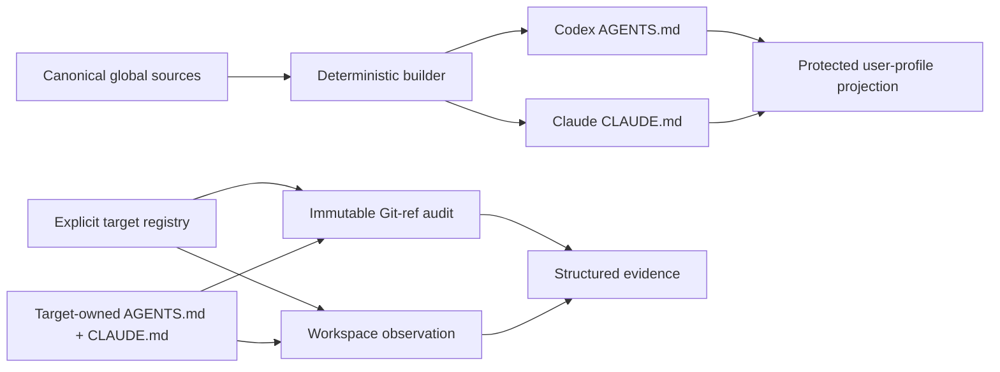
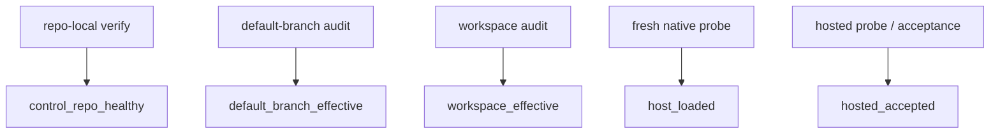

# Agent Rule Governance v2 Architecture

## Decision

The repository is a static governance control plane for OpenAI Codex and
Anthropic Claude Code instruction files. It does not execute AI coding tasks
or operate a service.

This shape is optimal for the current product because every accepted
requirement is a source, validation, projection, audit, or evidence problem.
None requires durable application state, request serving, background workers,
or model invocation.

## Ownership Model

The control repository owns global sources, adapter rules, target
registration, validation, projection, aggregate CI, and evidence. A target
repository owns all project-specific instructions and enforcement.

## Components

| Component | Responsibility | Explicitly does not own |
| --- | --- | --- |
| `rules/global/sources/` | Shared body and Codex/Claude platform fragments | Target project facts |
| `build-global-rules.py` | Deterministic LF/no-BOM assembly and drift check | Runtime templating service |
| `rules/manifest.json` | Two user-level global projections | Target rule distribution |
| coordination registry + schema | Explicit nine-target scope and audit contract | Repository discovery as auto-enrollment |
| `verify-target-project-rules.py` | Git-ref/workspace contract inspection | Checkout, reset, clean, merge, or apply |
| `sync-agent-rules.py` | Dry-run, protected apply, backup, same-version drift protection | Provider/auth/account state |
| `rulesctl.py` | Short-lived orchestration and JSON results | Daemon or task scheduler |
| GitHub Actions | Repo-local and aggregate drift gates | Target product build/test acceptance |

## Host Adapters

The common body is host-neutral, but loading is not unified:

- Codex natively discovers `AGENTS.md` through its global and root-to-CWD
  instruction chain, subject to override, fallback, trust, and byte-budget
  behavior.
- Claude Code natively discovers `CLAUDE.md`; the target default is a one-line
  `@AGENTS.md` import, with nested/lazy loading and settings semantics verified
  independently.
- Instructions provide context. Deterministic blocking belongs to settings,
  permissions, sandboxing, hooks, scripts, or CI owned by the appropriate
  host, administrator, or target repository.

A common runtime abstraction would hide meaningful semantic differences. The
architecture therefore shares source text while keeping separate adapters.

## State Model

These are parallel evidence dimensions, not a promotion chain. `verify` may
pass while a target audit fails. A default branch may pass while a dirty local
workspace fails. Native loading and hosted acceptance remain `unknown` without
their own fresh evidence.

## Technology Stack

- Markdown: reviewable instruction and operator documents
- JSON and JSON Schema: manifests, registry, matrix, and structured results
- Python standard library: deterministic build, parse, validate, audit, sync,
  and tests
- PowerShell: optional Windows wrapper for the Python sync entrypoint
- Git: immutable revision selection, rollback, and archive boundary
- GitHub Actions: repository-local and aggregate CI checks

There is no active third-party application dependency. Introducing a database,
web stack, broker, or language rewrite would create deployment and migration
work without adding evidence that either host loaded the intended rules.

## Security And Reliability

- External repositories and config are untrusted input and are parsed without
  executing target commands.
- Default-branch audit reads Git objects and does not move target worktrees.
- Global projection defaults to dry-run, blocks same-version drift, writes
  atomically, and keeps backups for apply.
- User-profile projection, target mutation, native host probing, and hosted
  acceptance are distinct authorization boundaries.
- The hotspot gate rejects runtime, UI, Gemini, provider, session, and
  orchestration surfaces from the active tracked tree.

## Alternatives Considered

| Alternative | Decision | Reason |
| --- | --- | --- |
| Keep the general runtime and hide unused features | Rejected | Leaves misleading live surfaces, large gates, and unclear ownership. |
| Centralize every target rule body | Rejected | Creates a second source of truth and flattens project differences. |
| Blind-generate target rules | Rejected | Conflicts with target ownership and dirty-worktree safety. |
| Build a web service/database | Rejected | No requirement needs durable service state or remote request handling. |
| Adopt many-agent config generation | Deferred | The product is intentionally limited to Codex and Claude. |
| Add skills/plugins/MCP/subagents | Deferred | These solve execution extension, not the current rule-governance problem. |

## Evolution Criteria

Only add a new surface when a concrete accepted requirement cannot be met by
the retained stack, its owner is explicit, native semantics are sourced, a
migration/rollback path exists, and the fixed gates can verify it. Remote repo
rename, enterprise managed-policy deployment, and hosted acceptance remain
separate release decisions.

Source details and fixed community references are recorded in
[agent-rule-governance-v2-sources.md](../research/agent-rule-governance-v2-sources.md).
