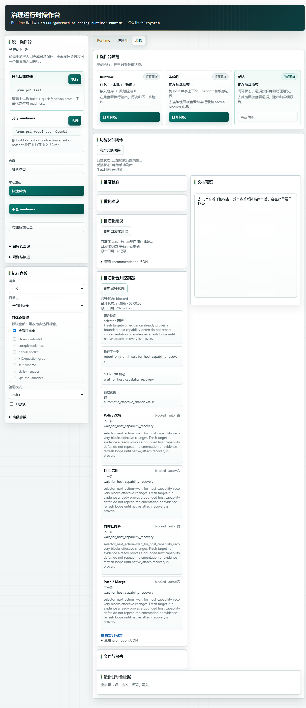
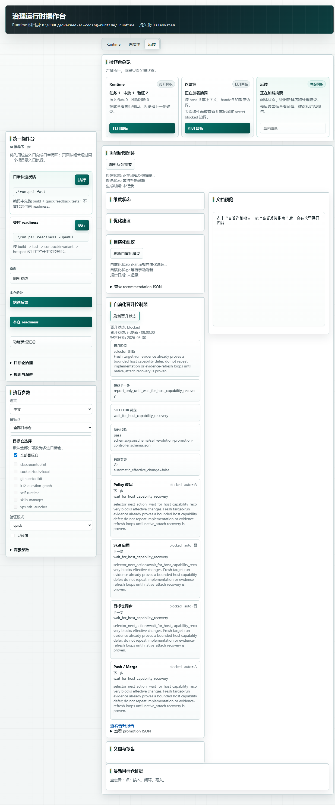

# 20260530 Self-Evolution Promotion Controller

## Goal
Add an executable, non-mutating controller for self-evolution promotion so the operator can see how policy mutation, skill enablement, target repo sync, and push/merge would be triggered without granting those effective changes automatically.

## Changes
- Added `scripts/plan-self-evolution-promotion.py` and `.ps1`.
- Added operator action `SelfEvolutionPromotionPlan` and `run.ps1` aliases.
- Chained the promotion controller after `SelfEvolutionRecommend`, so `FeedbackReport` and `DailyAll` refresh both recommendation and promotion state.
- Added `/api/self-evolution/promotion` and an Operator UI panel under the feedback/self-evolution surface.
- Added `schemas/jsonschema/self-evolution-promotion-controller.schema.json`, its spec, catalog wiring, and a Contract gate artifact schema check.
- Added `schemas/examples/self-evolution-promotion-controller/blocked-by-selector.example.json` as a reusable blocked-state example.
- Added visible `contract_validation` status to the Operator UI promotion panel.
- Generated `docs/change-evidence/self-evolution-promotions/20260530-self-evolution-promotion-controller.json`.

## Verification
- `python -m unittest tests.runtime.test_self_evolution_readiness tests.runtime.test_operator_entrypoint tests.runtime.test_operator_ui -v`: pass, 58 tests.
- `python -m unittest tests.runtime.test_self_evolution_readiness.SelfEvolutionReadinessTests.test_promotion_controller_schema_is_catalogued tests.runtime.test_self_evolution_readiness.SelfEvolutionReadinessTests.test_promotion_controller_verifier_rejects_schema_invalid_artifact tests.runtime.test_self_evolution_readiness.SelfEvolutionReadinessTests.test_verify_repo_docs_runs_self_evolution_promotion_gate tests.runtime.test_self_evolution_readiness.SelfEvolutionReadinessTests.test_promotion_controller_verifier_passes_current_generated_artifact -v`: pass, 4 tests.
- `python -m unittest tests.runtime.test_self_evolution_readiness -v`: pass, 14 tests.
- `python scripts/plan-self-evolution-promotion.py --as-of 2026-05-30 --write-artifacts`: pass and writes the controller JSON.
- `pwsh -NoProfile -ExecutionPolicy Bypass -File scripts/operator.ps1 -Action SelfEvolutionPromotionPlan`: pass.
- `python scripts/verify-self-evolution-promotion.py`: pass; all four lanes are blocked with `automatic_enabled=false`.
- `pwsh -NoProfile -ExecutionPolicy Bypass -Command '$payload = Get-Content -Raw "docs/change-evidence/self-evolution-promotions/20260530-self-evolution-promotion-controller.json"; if (Test-Json -Json $payload -SchemaFile "schemas/jsonschema/self-evolution-promotion-controller.schema.json") { "OK schema-test-json" } else { exit 1 }'`: pass.
- `pwsh -NoProfile -ExecutionPolicy Bypass -Command '$payload = Get-Content -Raw "schemas/examples/self-evolution-promotion-controller/blocked-by-selector.example.json"; if (Test-Json -Json $payload -SchemaFile "schemas/jsonschema/self-evolution-promotion-controller.schema.json") { "OK self-evolution-promotion-controller-example" } else { exit 1 }'`: pass.
- `python -m unittest tests.runtime.test_operator_entrypoint.OperatorEntrypointTests.test_operator_ui_self_evolution_promotion_reads_latest_artifact tests.runtime.test_operator_entrypoint.OperatorEntrypointTests.test_operator_ui_self_evolution_promotion_missing_state tests.runtime.test_operator_ui.OperatorUiTests.test_operator_ui_interactive_mode_renders_actions_and_ref_buttons -v`: pass, 3 tests.
- `node --check .runtime/artifacts/operator-ui/interactive-script.js`: pass.
- `pwsh -NoProfile -ExecutionPolicy Bypass -File scripts/operator-ui-service.ps1 -Action Restart -UiLanguage zh-CN -Port 8770`: pass; `ready=true`, `stale=false`, PID `40708`.
- `pwsh -NoProfile -ExecutionPolicy Bypass -File scripts/build-runtime.ps1`: pass.
- `pwsh -NoProfile -ExecutionPolicy Bypass -File scripts/verify-repo.ps1 -Check Runtime`: pass, 112 test files, failures=0.
- `pwsh -NoProfile -ExecutionPolicy Bypass -File scripts/verify-repo.ps1 -Check Contract`: pass.
- `pwsh -NoProfile -ExecutionPolicy Bypass -File scripts/doctor-runtime.ps1`: pass with the existing `WARN codex-capability-degraded`.
- `pwsh -NoProfile -ExecutionPolicy Bypass -File scripts/verify-repo.ps1 -Check Docs`: pass.
- `git diff --check`: pass with CRLF warnings only.
- Browser verification at `http://127.0.0.1:8770/?lang=zh-CN`: pass; the feedback tab shows `自演化晋升控制器`, `selector 阻断`, and all four lanes as `blocked · auto=否`.
- Browser verification after contract UI wiring: pass; the promotion summary shows `契约校验` = `pass` and `schemas/jsonschema/self-evolution-promotion-controller.schema.json`.
- Screenshot pixel check for `operator-ui-self-evolution-promotion-contract.png`: size `(1234, 2962)`, mean `237.83`, extrema `(15, 255)`, bytes `553380`.

## Current Result
The current controller status is `blocked`, `promotion_stage=blocked_by_selector`, and `selector_next_action=wait_for_host_capability_recovery`. All four effective-change lanes remain `automatic_enabled=false`.
The controller artifact is now also schema-governed and checked by `verify-repo.ps1 -Check Contract` as `OK self-evolution-promotion-artifact-schema`.

## UI Evidence

## pre_change_review
- control_repo_manifest_and_rule_sources: no `rules/manifest.json`, `AGENTS.md`, `CLAUDE.md`, `GEMINI.md`, or rule-source file changes are part of this slice; the new controller stays under scripts/schemas/docs/tests and does not redistribute agent rules.
- user_level_deployed_rule_files: no user-level deployed rule file is changed or synced by this slice.
- target_repo_deployed_rule_files: no target-repo deployed rule file is changed or synced by this slice.
- target_repo_gate_scripts_and_ci: target repo gates/CI are not edited; target sync remains an explicit, disabled lane in the controller report.
- target_repo_repo_profile: target repo profiles are not edited; the controller only reports `target_repo_sync` as blocked.
- target_repo_readme_and_operator_docs: operator-facing docs are updated only to document the non-mutating `SelfEvolutionPromotionPlan` trigger and its UI surface.
- current_official_tool_loading_docs: local `codex --version` returned `codex-cli 0.134.0`; `codex --help` confirms project loading/config/sandbox/approval surfaces remain CLI concerns, and this slice does not change Codex loading rules.
- drift-integration decision: integrate the schema and `scripts/verify-repo.ps1` Contract check in the control repo only; do not apply policy, enable skills, sync targets, push, or merge from this controller.

## Rollback
Remove `scripts/plan-self-evolution-promotion.py`, `scripts/plan-self-evolution-promotion.ps1`, the `SelfEvolutionPromotionPlan` operator/UI wiring, `schemas/jsonschema/self-evolution-promotion-controller.schema.json`, `schemas/examples/self-evolution-promotion-controller/blocked-by-selector.example.json`, `docs/specs/self-evolution-promotion-controller-spec.md`, the schema catalog/example README entries, this evidence file, and `docs/change-evidence/self-evolution-promotions/20260530-self-evolution-promotion-controller.json`.
