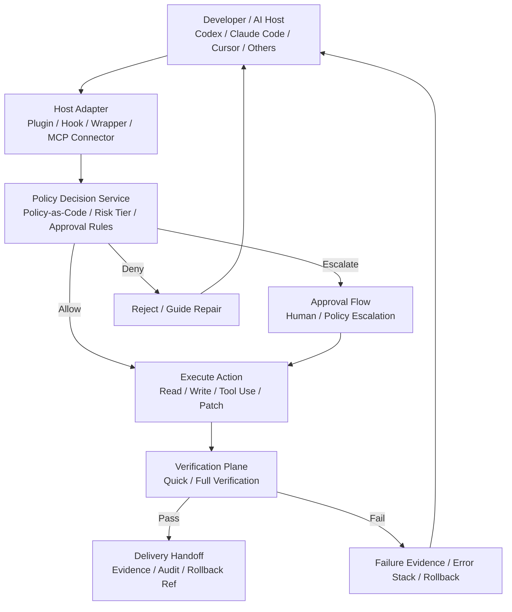

# Governed AI Coding Runtime：定位、路线图与竞品分层说明（优化版）

> **一句话定义**  
> **Governed AI Coding Runtime = The Universal Governance Layer for AI Coding Agents.**
>
> 它不是另一个 AI 编码宿主，也不是又一个通用多代理编排壳层；它位于 Codex、Claude Code、Cursor、Windsurf、Hermes、OpenHands 等执行宿主之上，负责统一策略、审批、验证、交付、审计与回滚控制。

---

## README 首页建议呈现方式

如果此文档用于对外仓库，建议：

- **README 首页只保留精简版**：一句话定义、当前阶段、非目标、架构图、核心主张、docs 链接。
- **本文件作为 docs 详版**：保留四层架构、竞品分层、路线图、设计取舍与传播表述。

这样可以兼顾：

- 首页 30 秒可理解
- 详版可完整论证
- 避免 README 首页过长、信息过密

---

## 一、当前阶段

本项目当前已经具备“治理运行时契约层”的基础能力，可用于：

- 仓库健康验证
- Foundation 级 build 与 doctor 门禁
- 第一个只读 trial
- 一组核心 contract primitives

当前已明确存在的核心模块包括：

- task intake
- repo profile
- workspace isolation
- write policy
- approval
- verification runner
- delivery handoff
- eval trace
- control console facade

本项目**已经可用，但尚不是完整可直接部署的生产级 runtime service**。  
当前仍缺：

- 生产级 runtime service
- durable workflow worker / durable storage
- 稳定 operator surface
- 完整发布构建与包分发能力
- 更成熟的持久化与服务化运行形态

---

## 二、项目定位

### 2.1 核心定位

**Governed AI Coding Runtime** 的定位不是“替代宿主”，而是“治理宿主”。

它的目标不是与 Codex CLI / App、Claude Code、Claude Cowork、Cursor、Windsurf 等宿主竞争以下能力：

- 更强的模型推理
- 更强的原生工具调用
- 更完整的会话体验
- 更炫的多代理交互 UX
- 更厚的插件生态
- 更强的 computer use / browser use

它真正要解决的问题是：

> 当不同 AI 编码宿主越来越强、越来越自动化时，如何确保它们在真实仓库与真实工程中，仍然按统一规则、安全、可验证、可审计、可回滚地执行。

### 2.2 核心价值

本项目要把“组织希望 AI Agent 遵守的规则”，从零散 prompt、人工流程和口头约定，升级为：

- **可执行的契约**
- **可判定的策略**
- **可追溯的审批**
- **可复用的验证**
- **可审计的证据**
- **可回滚的交付闭环**

### 2.3 开发者体验承诺

本项目追求的不是“强存在感治理”，而是：

> **Low-friction governance**  
> 对符合契约的常规操作，治理层尽量隐形；  
> 只有在越权、破坏性写入、未验证交付、违反仓库策略或存在高风险动作时，系统才显式介入并引导修复。

换言之：

- **合规操作默认轻量通过**
- **高风险动作必须可见、可控、可追溯**
- **本地与 CI 使用同一份契约，减少规则漂移**

---

## 三、非目标

为避免与快速演进的宿主层、编排层和自治平台混淆，本项目当前明确**不以以下方向为目标**：

- 不是通用 AI 编码聊天宿主
- 不是 IDE / Terminal / Desktop 的会话壳层
- 不是以交互体验为核心的多代理编排工具
- 不是通用 computer-use / browser-use 平台
- 不是模型厂商绑定的插件市场
- 不是另一个 Cursor / Codex / Claude Code / OpenHands
- 不是“只靠 prompt 提醒规则”的轻约束工具
- 不是只做输入输出过滤的 Generation Guardrails 工具

---

## 四、为什么这个方向成立

随着 Codex、Claude Code、Claude Cowork、Cursor、Windsurf 等宿主持续演进，越来越多原本看起来“有价值”的能力，会被宿主原生吸收，包括：

- 基础会话交互
- 通用 slash commands / skills
- 多代理协作体验
- worktree / 分支工作流
- 本地自动化与后台任务
- 插件安装与工具接入
- MCP 接入与上下文管理

因此，如果一个项目继续试图做“另一个更强的宿主”或“另一个更花哨的编排壳层”，就会越来越落入红海。

但与此同时，另一个需求会越来越强：

> 当宿主越来越多、模型越来越强、自动化越来越深时，组织需要一个**跨宿主、跨模型、跨仓库的一致性治理层**。

这正是本项目应当收敛并强化的方向。

---

## 五、推荐的最终形态

### 5.1 结论

最优路线不是：

- 继续做另一个宿主
- 继续做另一个 oh-my-codex / oh-my-claudecode
- 只做一个 MCP server
- 只做一组 prompt / markdown 规范

而是：

> **Repo-native Contract Spec + Host Adapters + Policy Decision Service + Verification Plane**

也就是：

1. **以仓库原生规范为核心**
2. **通过宿主适配层自动接入**
3. **由独立策略引擎做判定**
4. **由独立验证/交付平面完成闭环**

### 5.2 为什么不是 “ALL IN MCP”

MCP 很重要，但它本质上是：

- 工具接入面
- 数据接入面
- 上下文接入面

它**不是天然的强制治理门禁**。  
如果没有 hook、plugin、wrapper、CI gate 或独立策略执行面配合，MCP 更像“可用工具”，而不是“必经控制点”。

因此更稳的表述应是：

> **ALL IN Policy-as-Code + Host Adapters + Verification**

MCP 是重要接入面之一，但不是完整治理面的唯一抓手。

---

## 六、架构图（Visual Map）

---

## 七、四层架构

## 7.1 第一层：Repo-native Contract Spec

这是项目最核心的一层。

它不依赖某个特定宿主，不依赖某个模型厂商，也不依赖某个 IDE。  
它以类似 `.governed-ai/` 的仓库内规范为核心，定义治理运行时所需的最小契约。

典型内容包括：

- repo profile
- task intake schema
- workspace boundary
- write policy
- approval matrix
- verification profile
- handoff package schema
- evidence / audit schema
- rollback reference contract

这一层的目标是：

- **宿主无关**
- **语言无关**
- **平台无关**
- **可进入版本控制**
- **可进入代码评审**
- **可被 CI 与本地共同消费**

### 这一层的意义

只要一个工具能读取仓库文件，它就至少能理解基础治理规则。  
这使项目天然具备：

- 可移植性
- 可审查性
- 可扩展性
- 可长期维护性

---

## 7.2 第二层：Host Adapters

第二层负责把治理层接入真实宿主。

适配对象包括但不限于：

- Codex CLI / App
- Claude Code
- Claude Cowork
- Cursor
- Windsurf
- OpenCode
- Hermes / OpenHands / SWE-agent 等平台
- GitHub / CI / automation runner

### 适配形式

宿主适配层可以采用多种形式：

- Plugin
- Hook
- Wrapper CLI
- Skill bundle
- MCP connector
- Repo instructions bridge
- CI integration

### 设计原则

这一层的目标不是重做宿主，而是：

- 让宿主在关键节点能读到治理规则
- 让宿主在动作执行前能触发策略判定
- 让宿主在执行后能进入验证闭环
- 让宿主能回传证据、失败栈与交付结果

### 为什么不能只押一个接入形式

单一接入形式都不够稳：

- 只靠 repo 文件：自动化不够强
- 只靠 plugin：宿主耦合过高
- 只靠 MCP：不是天然强制门禁
- 只靠 hook：覆盖面有限
- 只靠 wrapper：开发者可能绕过

因此最佳实践应当是：

> **文件约定是基础层，plugin/hook/wrapper/MCP 是增强层。**

---

## 7.3 第三层：Policy Decision Service

第三层负责做“是否允许执行”的独立判定。

这是治理层与“普通辅助工具”的关键分界线。

### 这一层负责回答的问题

- 这个动作是否允许？
- 这个写入是否越权？
- 这个目录是否可改？
- 这个操作是否需要审批？
- 这个任务是否超出了 repo profile 允许范围？
- 这个动作是否应升级到高风险模式？
- 这个例外是否可批准？
- 这个结果是否可进入交付阶段？

### 为什么需要独立策略层

因为治理不能只靠：

- prompt 记忆
- 模型自觉
- README 提醒
- 人工习惯

治理必须把“规则”从叙述升级为“决策”。

### 建议路线

这一层应采用 **Policy-as-Code** 思路，而不是把所有判断逻辑塞进：

- 宿主插件内部
- 单个 MCP server
- 一堆 prompt
- 一堆 shell 脚本

核心目标是：

- 策略统一
- 判定可重用
- 行为可审计
- 宿主间一致
- 本地与 CI 一致

---

## 7.4 第四层：Verification & Delivery Plane

第四层负责把执行结果拉入完整闭环。

它不是“最后补个测试”，而是治理可信度的核心组成部分。

### 这一层包含

- quick verification
- full verification
- policy checks
- contract validation
- artifact generation
- delivery handoff
- audit evidence
- rollback reference

### 为什么这一层必须独立存在

因为真正的治理不应停留在“动作开始前”。  
它必须覆盖：

1. **动作前是否允许**
2. **动作后是否通过验证**
3. **失败时是否有证据**
4. **交付时是否可审计**
5. **出现问题时是否可回滚**

### CI Gate 的地位

CI Gate 不应只是一个附属点，而应被明确视为**最后防线**。

原因很简单：

- 本地 agent 可能被终止
- 本地 hook 可能失效
- 插件可能未安装或被绕过
- 开发者可能手工改代码
- 宿主行为可能随版本变化而变化

因此应明确强调：

> `.governed-ai/` 规范不仅驱动本地 agent runtime，也驱动 CI pipeline。  
> 本地放跑的越权或未验证代码，CI 会基于同一份契约再次判定并拦截。

---

## 八、执行流与闭环流

## 8.1 执行前治理流

当宿主准备执行一个动作时：

1. 宿主产生代码修改或工具调用请求
2. Host Adapter 捕获关键上下文
3. 将请求送交 Policy Decision Service
4. 策略层返回三类结果之一：
   - Allow
   - Escalate
   - Deny
5. Allow 则执行；Escalate 进入审批；Deny 则返回宿主并引导修复

## 8.2 执行后闭环流

当动作执行完成后：

1. 统一进入 Verification Plane
2. 执行 quick 或 full verification
3. 验证通过：
   - 生成 Delivery Handoff
   - 记录 Evidence / Audit / Rollback Reference
4. 验证失败：
   - 输出 Failure Evidence
   - 生成错误栈 / 不合规原因
   - 必要时触发回滚
   - 将修复线索返还给宿主 AI

---

## 九、与竞品、相邻项目的分层关系

## 9.1 宿主层

这一层的产品负责实际执行任务，是“会读代码、会改代码、会跑命令、会交互”的主载体。

典型代表：

- Codex CLI / App
- Claude Code
- Claude Cowork
- Cursor
- Windsurf
- OpenCode

### 这一层的典型特点

- 原生会话与 IDE / Terminal 集成
- 工具调用与文件修改
- 原生多代理或子代理能力
- worktree / Git / automation
- 插件与扩展生态
- 更厚的交互体验

### 与本项目的关系

不是同类。  
本项目不应去替代这一层，而应治理这一层。

---

## 9.2 宿主增强 / 编排层

这一层不重做宿主，而是在宿主之上增加编排能力。

典型代表：

- oh-my-codex
- oh-my-claudecode
- 类似的 orchestration wrapper / team workflow 工具

### 这一层的典型特点

- 多代理 orchestration
- hooks / wrapper / team mode
- 更强的交互型 workflow
- 在原生宿主之上增加协作体验

### 与本项目的关系

有局部重叠，但不应正面竞争。  
如果本项目继续向“另一个 oh-my-xxx”方向发展，就会进入更拥挤的红海。

---

## 9.3 自治 agent 平台层

这一层更接近完整或趋近完整的 autonomous agent platform。

典型代表：

- Hermes Agent
- OpenHands
- SWE-agent

### 这一层的典型特点

- 长生命周期执行
- 可部署、可托管
- 持久记忆与学习循环
- 更接近完整 runtime platform
- 不一定依赖 IDE / Terminal 宿主

### 与本项目的关系

属于相邻赛道。  
如果本项目未来演进成完整 runtime service，并承担持续自治执行与托管能力，就会逐步靠近这一层。  
但以当前阶段而言，本项目仍更应收敛到治理内核，而不是直接扩展成完整自治平台。

---

## 9.4 治理层 / 控制面层

这是与本项目最接近的层级。

典型代表包括：

- Microsoft Agent Governance Toolkit
- GAAI-framework
- Keycard for Coding Agents
- Coder AI Gateway

### 这一层的典型特点

- runtime governance
- policy enforcement
- 审批、权限、边界控制
- 统一治理与审计
- 宿主无关或弱宿主绑定
- 更像 control plane，而不是 execution host

### 与本项目的关系

这是本项目最值得对标的层级。  
与其追逐宿主功能，不如成为宿主之上的统一治理层。

---

## 9.5 相邻但不等价的 Guardrails 类项目

典型代表：

- NeMo Guardrails
- Guardrails AI

### 正确区分方式

它们更适合作为：

- **Generation Guardrails**  
  管模型输入输出、管模型“说什么”

而本项目更适合定义为：

- **Runtime / Action Guardrails**  
  管 Agent “做什么”、管动作边界、管交付闭环

### 这个区分非常重要

因为它明确了本项目的价值不在“输出文本是否得体”，而在：

- 文件能不能改
- 哪些目录能写
- 是否需要审批
- 是否进入验证
- 是否允许交付
- 是否留下证据
- 是否具备回滚路径

---

## 十、为什么“自动生效 + 宿主搭配使用”是最佳形态

## 10.1 结论

是的，**在 Codex / Claude Code 等 AI 会话式编码中自动生效，并与宿主搭配使用**，确实是最佳方向。  
但要把这句话说完整：

> 自动生效的最佳形态，不是“只装一个插件”或“只接一个 MCP server”，而是  
> **文件规范 + Host Adapter + 策略判定 + 验证闭环** 的混合形态。

### 原因

如果只做“仓库内规范”：

- 宿主能读，但未必稳定执行

如果只做“插件”：

- 自动化更强，但宿主耦合更高

如果只做“MCP server”：

- 接入标准化更好，但不天然是必经门禁

如果只做“wrapper CLI”：

- 容易被绕过

因此最优形态应是：

- **基础层：仓库文件驱动**
- **增强层：plugin / hook / wrapper / MCP**
- **决策层：Policy-as-Code**
- **闭环层：Verification + CI Gate**

---

## 十一、推荐的混合最终形态

### 11.1 保持并强化核心

继续以 `.governed-ai/` 与完整 contract primitives 为核心资产：

- repo profile
- task intake
- write policy
- approval
- workspace isolation
- verification
- delivery handoff
- eval trace
- evidence schema
- rollback reference

### 11.2 新增轻量集成层

发布官方适配器，而不是重做宿主：

- Codex plugin / skill / wrapper
- Claude plugin / hooks / skill bundle
- 必要时提供 MCP connector
- CI / GitHub integration

### 11.3 保持开放兼容

任何能读取仓库文件的工具，都能消费基础治理规范。  
任何想获得更强自动化体验的工具，再安装官方适配器即可。

### 11.4 将策略判定独立出来

ALL IN 的重点不应是“只押 MCP”，而应是：

> **ALL IN Policy-as-Code + Host Adapters + Verification**

MCP 是重要接入面之一，但不应被误认为完整治理面。

### 11.5 把 CI Gate 提到核心位置

本地治理不是终点。  
真正组织级可信的治理必须满足：

> **同一份契约，本地能检查，CI 也能检查。**

---

## 十二、最优发展路线图（Roadmap）

## 12.1 Phase 1：停止与宿主正面竞争，坐实治理内核

短期内的战略重点应该是：

- 停止扩展通用宿主能力
- 不再试图做另一个 oh-my-claude / oh-my-codex
- 不再与原生 CLI 比拼基础执行、基础交互、基础编排

转而集中强化：

- repo-native contract spec
- write policy / risk tier
- approval state model
- verification profiles
- delivery handoff
- audit evidence
- rollback contracts

### 这一阶段的目标

让项目明确成为：

> **治理运行时契约内核**

---

## 12.2 Phase 2：做官方 Host Adapters，而不是重做宿主

中期应发布：

- governed-codex / Codex wrapper
- Codex plugin / skills / hook support
- Claude plugin / hooks / skills
- 基础 MCP connector
- GitHub / CI integration

### 这一阶段的目标

让开发者能继续正常使用熟悉的宿主，而你的项目在关键动作前后自动介入：

- 本地自动感知
- 风险动作升级
- 验证闭环执行
- 交付证据沉淀

---

## 12.3 Phase 3：将 Policy-as-Code 独立为统一决策中枢

把策略判定从：

- prompt
- markdown
- plugin 内部逻辑
- shell 脚本
- 单个 connector

中抽离出来，形成统一 policy decision service。

### 这一阶段要解决的问题

- 宿主之间规则不一致
- 本地与 CI 判定不一致
- 审批矩阵分散
- 风险级别不可复用
- 规则难以审计

### 这一阶段的目标

无论是 Codex、Claude、Cursor、Windsurf，还是未来宿主，都能共享同一套治理决策逻辑。

---

## 12.4 Phase 4：补齐完整 Runtime Service

最后才进入更重的服务化阶段：

- durable storage
- workflow worker
- operator surface
- dashboard / status surface
- 发布构建与分发
- 组织级策略分发
- 更成熟的多环境治理运行时

### 这一阶段的目标

把项目从“治理契约层”推进为“完整治理运行时服务”，但前提是前面三层已经稳定，不再与宿主层发生战略混淆。

---

## 十三、README 首页建议版本（精简版）

> **Governed AI Coding Runtime = The Universal Governance Layer for AI Coding Agents.**  
> 它不替代 Codex、Claude Code、Cursor 等执行宿主，而是在它们之上统一策略、审批、验证、交付、审计与回滚控制。

### 当前阶段

- 已具备基础治理契约层能力
- 可做仓库验证、只读 trial、基础门禁与核心 contract primitives
- 尚未成为完整生产级 runtime service

### 非目标

为避免与快速演进的宿主层混淆，本项目当前明确不以以下方向为目标：

- 通用 AI 编码宿主
- 交互型多代理编排壳层
- 通用 computer-use 平台
- 模型绑定型插件市场
- 只做生成侧 guardrails 的工具

### 核心主张

- 宿主负责做事
- 本项目负责让宿主按规则、安全、可验证地做事
- 本地与 CI 使用同一份契约
- 合规操作低摩擦通过，越权动作显式拦截

### 结尾主张

> **Don’t compete with the host. Govern the host.**

---

## 十四、对外传播主张（可选）

### 14.1 Slogan

**The Universal Governance Layer for AI Coding Agents**

### 14.2 核心传播语

- Don’t compete with the host. Govern the host.
- Low-friction governance for high-trust AI coding
- One contract, local and CI consistent
- Runtime / Action Guardrails for AI Coding Agents

### 14.3 对外解释模板

本项目不是另一个 AI 编码工具，而是一个位于 AI 编码宿主之上的统一治理层。  
它让 Codex、Claude Code、Cursor 等工具在真实仓库中执行时，遵守同一套 repo policy、write controls、approval rules、verification profiles 与 delivery contracts。对合规操作，它尽量无感；对越权、高风险或未验证交付，它会显式介入、拦截并引导修复。

---

## 十五、可选外链（对外版本可加）

如果此文档将用于公开发布，建议在竞品或参考资料附录中补上官方链接，提升可信度与可验证性。可优先加入：

- Microsoft Agent Governance Toolkit
- GAAI-framework
- Keycard for Coding Agents
- Coder AI Gateway
- Open Policy Agent (OPA)
- NeMo Guardrails
- Guardrails AI

若此文档主要用于内部 PRD，可不强制加入，以保持阅读密度。

---

## 十六、最终结论

本项目最优的长期定位，不是：

- 另一个宿主
- 另一个壳层
- 另一个花哨编排器

而是：

> **一个跨宿主、跨模型、跨仓库的统一治理控制面。**

它的最佳形态不是“只做 MCP Server”，而是：

> **Repo-native Contract Spec + Host Adapters + Policy Decision Service + Verification Plane**

它不应与宿主竞争“谁更强”，而应成为宿主之上的那层：

- 统一边界
- 统一策略
- 统一验证
- 统一交付
- 统一审计
- 统一回滚

> **Don’t compete with the host. Govern the host.**
